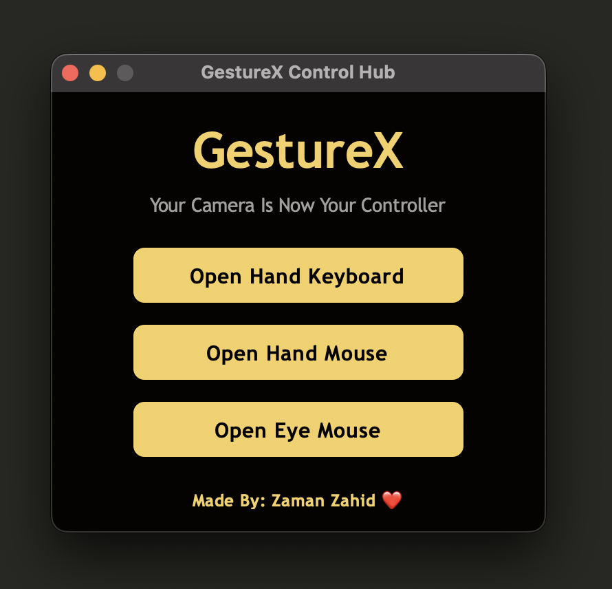
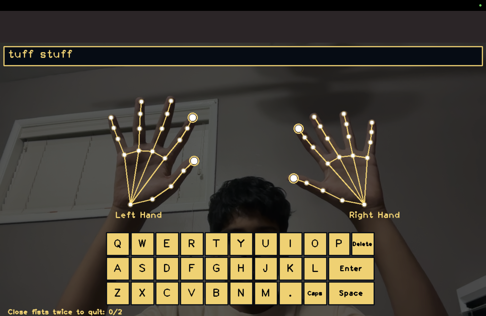

# GestureX
I made a computer vision project that lets you control your computer in different ways like using hand tracking and eye tracking through your camera. It has a hand-controlled mouse, hand keyboard, and eye-tracking mouse system, all connected through one hub. The project was built using Python, OpenCV, MediaPipe, and CVZone.


The project includes:
- Main Control Hub
- Hand Mouse
- Hand Keyboard
- Eye Mouse

---

## Main Hub
- Launch all applications from one hub

<div align="center">
  
</div>

---

## Hand Keyboard
- Type using finger tracking
- Hover over letters then Pinch fingers together to press keys

<div align="center">
  
  <br/>
  <video src="Videos/KeyboardControl.mp4" width="600" controls></video>
</div>

---

## Hand Mouse
- Move mouse with hand tracking
- Left click using thumb + index finger
- Right click using thumb + middle finger
- Close application by making a fist twice

<div align="center">
  
  <br/>
  <video src="HandControl.mp4" width="600" controls></video>
</div>

---

## Eye Mouse
- Move cursor with eye tracking
- Left blink = left click
- Right blink = right click
- Close both eyes for 3.5 seconds to quit

<div align="center">
  
  <br/>
  <video src="EyeMouse.mp4" width="600" controls></video>
</div>

---

# Installation

Install dependencies:

```bash
pip install opencv-python mediapipe==0.10.21 pyautogui cvzone cvlib numpy pillow pynput

